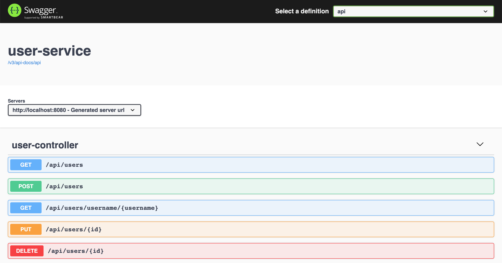

# springboot-testing-mysql

The goals of this project are:
- Create a simple [`Spring Boot`](https://docs.spring.io/spring-boot/docs/current/reference/htmlsingle/) REST API to manage users called `user-service`. The database used is [`MySQL`](https://www.mysql.com);
- Explore the utilities and annotations that `Spring Boot` provides for testing applications;
- Test using [`Testcontainers`](https://www.testcontainers.org/).

## Application

- ### user-service

  `Spring Boot` Web Java application to manage users. The data is stored in `MySQL`
  
  

## Prerequisites

- [`Java 11+`](https://www.oracle.com/java/technologies/javase-jdk11-downloads.html)
- [`Docker`](https://www.docker.com/)
- [`Docker-Compose`](https://docs.docker.com/compose/install/)

## Start environment

- Open a terminal and inside `springboot-testing-mysql` root folder run
  ```
  docker-compose up -d
  ```

- Wait a bit until `MySQL` is `Up (healthy)`. You can check it by running
  ```
  docker-compose ps
  ```

## Start application

- In a terminal, make sure you are in `springboot-testing-mysql` root folder

- Run application
  ```
  ./gradlew user-service:clean user-service:bootRun
  ```

- Swagger website is http://localhost:8080/swagger-ui.html

## Shutdown

- Go to the terminal where `user-service` is running and press `Ctrl+C`

- In a terminal and inside `springboot-testing-mysql` root folder, run to command below to stop and remove docker-compose `mysql` container and network
  ```
  docker-compose down -v
  ```

## Running Unit and Integration Testing

- In a terminal, navigate to `springboot-testing-mysql` root folder

- Run unit and integration tests
  ```
  ./gradlew user-service:clean user-service:assemble \
    user-service:cleanTest \
    user-service:test \
    user-service:integrationTest
  ```
  > **Note:** During the tests, `Testcontainers` starts automatically `MySQL` docker container before the tests begin and shuts it down when the tests finish.

- **Unit Testing Report** can be found at
  ```
  user-service/build/reports/tests/test/index.html
  ```

- **Integration Testing Report** can be found at
  ```
  user-service/build/reports/tests/integrationTest/index.html
  ```

## Useful Commands

- **MySQL**
  ```
  docker exec -it mysql mysql -uroot -psecret --database userdb
  select * from users;
  ```

## References

- https://docs.spring.io/spring-boot/docs/current/reference/html/boot-features-testing.html
- http://www.baeldung.com/spring-boot-testing
