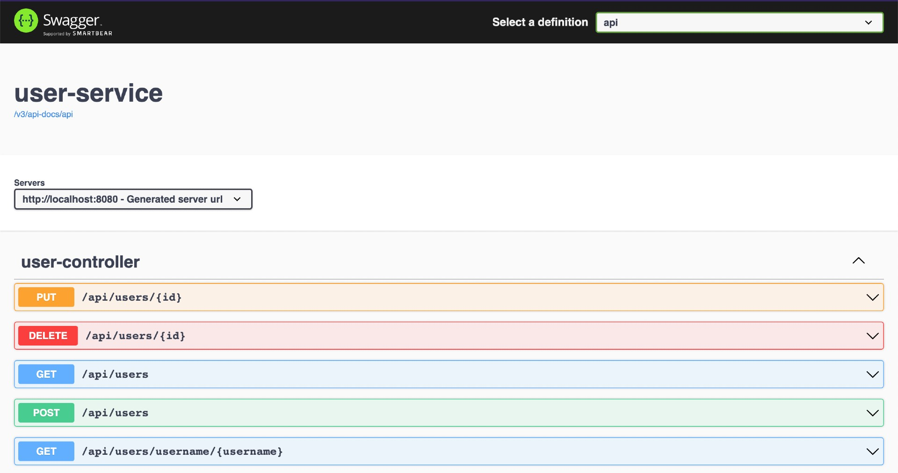

# springboot-testing-mysql

The goals of this project are:
- Create a simple [`Spring Boot`](https://docs.spring.io/spring-boot/docs/current/reference/htmlsingle/) application to manage users called `user-service`. The database used is [`MySQL`](https://www.mysql.com);
- Explore the utilities and annotations that `Spring Boot` provides for testing applications;
- Test using [`Testcontainers`](https://www.testcontainers.org/).

## Application

- ### user-service

  `Spring Boot` Web Java application to manage users. The data is stored in `MySQL`
  
  

## Prerequisites

- [`Java 17+`](https://www.oracle.com/java/technologies/downloads/#java17)
- [`Docker`](https://www.docker.com/)
- [`Docker-Compose`](https://docs.docker.com/compose/install/)

## Start Environment

- Open a terminal and inside `springboot-testing-mysql` root folder run
  ```
  docker-compose up -d
  ```

- Wait for `MySQL` Docker container to be up and running. To check it, run
  ```
  docker-compose ps
  ```

## Start Application

- In a terminal, make sure you are in `springboot-testing-mysql` root folder

- Run application
  ```
  ./gradlew user-service:clean user-service:bootRun
  ```

- Swagger website is http://localhost:8080/swagger-ui/index.html

## Shutdown

- Go to the terminal where `user-service` is running and press `Ctrl+C`

- In a terminal and inside `springboot-testing-mysql` root folder, run to command below to stop and remove docker-compose `mysql` container and network
  ```
  docker-compose down -v
  ```

## Running Unit and Integration Tests

- In a terminal, navigate to `springboot-testing-mysql` root folder

- Running Tests

  - Unit Tests only
    ```
    ./gradlew user-service:clean user-service:cleanTest user-service:test
    ```

  - Unit and Integration Tests
    ```
    ./gradlew user-service:clean user-service:cleanTest user-service:check user-service:integrationTest
    ```
    > **Note**: During the tests, `Testcontainers` starts automatically `MySQL` Docker container before the tests begin and shuts it down when the tests finish.

- **Unit Test Report** can be found at
  ```
  user-service/build/reports/tests/test/index.html
  ```

- **Integration Test Report** can be found at
  ```
  user-service/build/reports/tests/integrationTest/index.html
  ```

## Useful Commands

- **MySQL**
  ```
  docker exec -it -e MYSQL_PWD=secret mysql mysql -uroot --database userdb
  SELECT * FROM users;
  ```

## References

- https://docs.spring.io/spring-boot/docs/current/reference/html/boot-features-testing.html
- http://www.baeldung.com/spring-boot-testing
