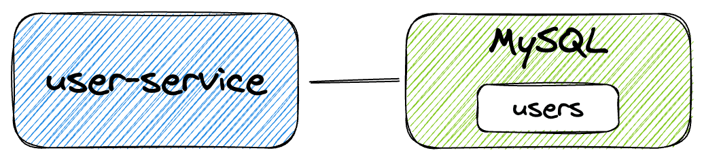

# springboot-testing-mysql

[](LICENSE)
[](https://buymeacoffee.com/ivan.franchin)

The goals of this project are to:
- Create a simple [`Spring Boot`](https://docs.spring.io/spring-boot/index.html) application to manage users called `user-service`. The database used is [`MySQL`](https://www.mysql.com).
- Explore the utilities and annotations that `Spring Boot` provides for testing applications.
- Test using [`Testcontainers`](https://testcontainers.com).

## Proof-of-Concepts & Articles

On [ivangfr.github.io](https://ivangfr.github.io), I have compiled my Proof-of-Concepts (PoCs) and articles. You can easily search for the technology you are interested in by using the filter. Who knows, perhaps I have already implemented a PoC or written an article about what you are looking for.

## Project Diagram



## Application

- ### user-service

  `Spring Boot` Web Java application to manage users. The data is stored in `MySQL`.

  It has the following endpoints:
  ```text
     GET /api/users
     GET /api/users/{id}
     GET /api/users?username={username}
    POST /api/users {"username":"...", "email":"...", "birthday":"..."}
   PATCH /api/users/{id} {"username":"...", "email":"...", "birthday":"..."}
  DELETE /api/users/{id}
  ```

## Prerequisites

- [`Java 25`](https://www.oracle.com/java/technologies/downloads/#java25) or higher;
- A containerization tool (e.g., [`Docker`](https://www.docker.com), [`Podman`](https://podman.io), etc.)

## Start Environment

- Open a terminal and inside the `springboot-testing-mysql` root folder run:
  ```bash
  docker compose up -d
  ```

- Wait for the `MySQL` Docker container to be up and running. To check it, run:
  ```bash
  docker ps -a
  ```

## Start Application

- In a terminal, make sure you are in the `springboot-testing-mysql` root folder;

- Run application:
  ```bash
  ./mvnw clean spring-boot:run --projects user-service
  ```

- The Swagger website can be accessed at http://localhost:8080/swagger-ui.html

## Useful Commands

- **MySQL**
  ```bash
  docker exec -it -e MYSQL_PWD=secret mysql mysql -uroot --database userdb
  SELECT * FROM users;
  ```

## Shutdown

- Go to the terminal where `user-service` is running and press `Ctrl+C`;

- In a terminal, inside the `springboot-testing-mysql` root folder, run the command below to stop and remove the Docker Compose `mysql` container and network:
  ```bash
  docker compose down -v
  ```

## Testing Strategy

The project demonstrates multiple Spring Boot testing layers:

| Test class                 | Annotation                     | What it tests                                                                       |
|----------------------------|--------------------------------|-------------------------------------------------------------------------------------|
| `UserControllerTests`      | `@WebMvcTest`                  | HTTP layer in isolation via `MockMvc`; service is mocked with `@MockitoBean`        |
| `UserRepositoryTests`      | `@DataJpaTest`                 | JPA queries against a real MySQL instance (Testcontainers); no full context         |
| `UserServiceTests`         | `@SpringExtension` + `@Import` | Service logic with the repository mocked; no Spring context overhead                |
| `CreateUserRequestTests`   | `@JsonTest`                    | JSON serialization/deserialization of the create request DTO                        |
| `UpdateUserRequestTests`   | `@JsonTest`                    | JSON serialization/deserialization of the update request DTO                        |
| `UserResponseTests`        | `@JsonTest`                    | JSON serialization/deserialization of the response DTO                              |
| `UserServiceApplicationIT` | `@SpringBootTest(RANDOM_PORT)` | Full end-to-end over HTTP with `TestRestTemplate` and a real MySQL (Testcontainers) |

A shared `MySQLTestcontainers` interface holds the `@ServiceConnection MySQLContainer` and is reused by both `UserRepositoryTests` and `UserServiceApplicationIT` — no duplicate container definitions.

## Running Unit and Integration Tests

- In a terminal, navigate to the `springboot-testing-mysql` root folder;

- Running Tests

  - Unit and slice tests only:
    ```bash
    ./mvnw clean test --projects user-service
    ```

  - Unit, slice, and integration tests:
    ```bash
    ./mvnw clean verify --projects user-service
    ```
    > **Note**: `Testcontainers` automatically starts a `MySQL` Docker container for both `@DataJpaTest` and `@SpringBootTest` tests. No manual Docker setup is required.

  - Run a single test class:
    ```bash
    ./mvnw test --projects user-service -Dtest=UserControllerTests
    ```

  - Run a single test method:
    ```bash
    ./mvnw test --projects user-service -Dtest=UserControllerTests#testGetUsersWhenThereIsNone
    ```

  - Run a single integration test class:
    ```bash
    ./mvnw verify --projects user-service -Dit.test=UserServiceApplicationIT
    ```

  - Run a single integration test method:
    ```bash
    ./mvnw verify --projects user-service -Dit.test=UserServiceApplicationIT#testCreateUser
    ```

## Code Formatting

This project enforces consistent Java formatting using the [Spotless](https://github.com/diffplug/spotless) Maven plugin with [google-java-format](https://github.com/google/google-java-format) (GOOGLE style).

- **Check formatting**:
  ```bash
  ./mvnw spotless:check
  ```
- **Auto-fix formatting**:
  ```bash
  ./mvnw spotless:apply
  ```

Formatting is also verified automatically as part of `./mvnw verify` (bound to the `verify` phase).

## How to optimize PNGs in documentation folder

[**Medium**] [**How I Reduce GIF and Screenshot Sizes for My Technical Articles on macOS**](https://medium.com/itnext/how-i-reduce-gif-and-screenshot-sizes-for-my-technical-articles-on-macos-7fea331afc68)

## Support

If you find this useful, consider buying me a coffee:

<a href="https://buymeacoffee.com/ivan.franchin"></a>

## License

This project is licensed under the [MIT License](./LICENSE).
